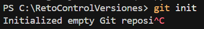
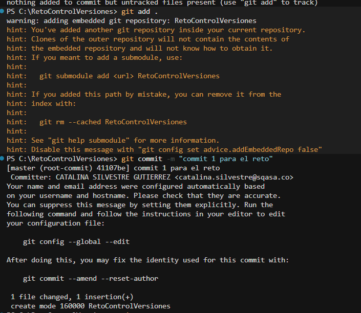
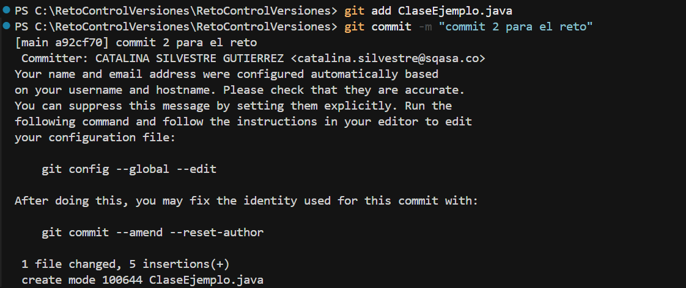
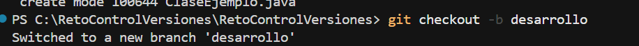
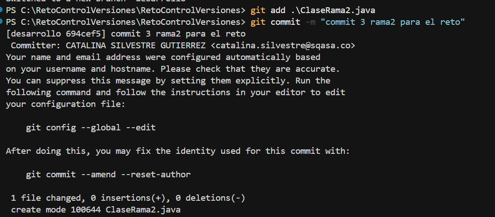
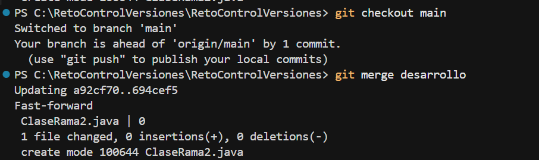
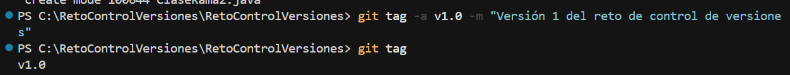
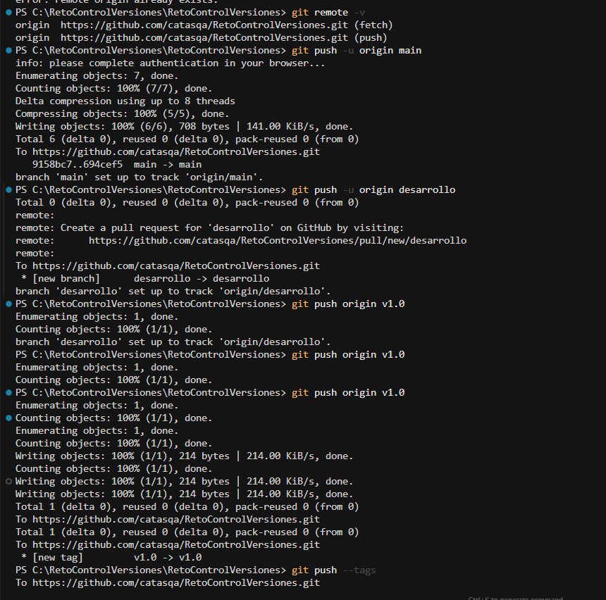

# 🚀 Reto Control de Versiones – Git y GitHub

Este repositorio corresponde a la evidencia del **Reto de Control de Versiones**, cuyo objetivo es demostrar el uso correcto de Git y GitHub aplicando buenas prácticas como commits, ramas, merge y tags.

---

## 🛠️ Herramientas utilizadas

* **Git**
* **GitHub**
* **PowerShell (Windows)**

---

## ⚠️ Problema presentado

Al iniciar el reto, al ejecutar comandos de Git se presentó el siguiente error:

> `git : El término 'git' no se reconoce como nombre de un cmdlet, función, archivo de script o programa ejecutable.`

Este error indicaba que Git no estaba instalado o no estaba correctamente configurado en el PATH del sistema operativo.

---

## ✅ Solución aplicada

1. Se descargó Git desde el sitio oficial:
   [https://git-scm.com/](https://git-scm.com/)

2. Durante la instalación se seleccionó la opción:
   **"Git from the command line and also from 3rd-party software"**.

3. Se cerraron todas las ventanas de PowerShell y se abrió una nueva sesión.

4. Se validó la correcta instalación ejecutando el comando:

```bash
git --version
```

📷 **Evidencia:**


---

## 🚀 Desarrollo del reto

### 1️⃣ Inicialización del repositorio local

Se creó el repositorio local con el siguiente comando:

```bash
git init
```

📷 **Evidencia:**



---

### 2️⃣ Primer commit

Se agregaron los archivos iniciales del proyecto y se realizó el primer commit con el mensaje solicitado:

```bash
git add .
git commit -m "commit 1 para el reto"
```

📷 **Evidencia:**



---

### 3️⃣ Segundo commit

Se creó un nuevo archivo/clase en el proyecto y se realizó el segundo commit:

```bash
git add .
git commit -m "commit 2 para el reto"
```

📷 **Evidencia:**



---

### 4️⃣ Creación de la rama `rama2`

Se creó una nueva rama llamada **rama2**:

```bash
git checkout -b rama2
```

📷 **Evidencia:**



---

### 5️⃣ Commit en la rama `rama2`

Dentro de la rama `rama2` se creó un nuevo archivo/clase y se realizó el commit correspondiente:

```bash
git commit -m "commit 3 rama2 para el reto"
```

📷 **Evidencia:**



---

### 6️⃣ Merge a la rama principal

Se regresó a la rama principal y se realizó el merge con la rama `rama2`:

```bash
git checkout main
git merge rama2
```

📷 **Evidencia:**



---

### 7️⃣ Creación del tag versión 1

Se creó un tag para marcar la versión 1 del proyecto:

```bash
git tag -a v1.0 -m "Versión 1 del reto de control de versiones"
```

📷 **Evidencia:**



---

### 8️⃣ Publicación en GitHub

Se creó un repositorio público en GitHub y se vinculó con el repositorio local. Posteriormente se subieron las ramas y el tag:

```bash
git push -u origin main
git push -u origin rama2
git push --tags
```

📷 **Evidencia:**



---

## 🌐 Repositorio remoto

🔗 **Repositorio en GitHub:**
[https://github.com/catasqa/RetoControlVersiones.git](https://github.com/catasqa/RetoControlVersiones.git)

---

## ✨ Conclusión

Se completó satisfactoriamente el reto, cumpliendo con todos los requerimientos solicitados:

* Uso correcto de commits
* Creación y manejo de ramas
* Merge a la rama principal
* Versionamiento mediante tags
* Publicación en un repositorio público en GitHub

Este proyecto evidencia el manejo básico y correcto del control de versiones utilizando Git y GitHub.
